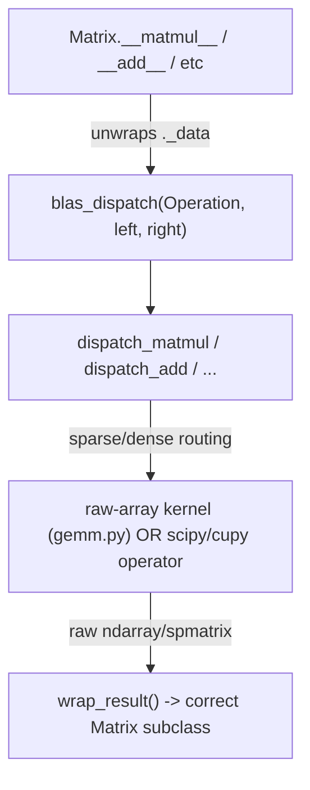

Optimized tool selection

Read [](file:///home/vmaillou/Repos/DALIA/src/dalia/backend)

Read [](file:///home/vmaillou/Repos/DALIA/src/dalia/backend/blas)

Read [](file:///home/vmaillou/Repos/DALIA/src/dalia/backend/datastructures)

Read [](file:///home/vmaillou/Repos/DALIA/src/dalia/backend/blas/__init__.py)

Read [](file:///home/vmaillou/Repos/DALIA/src/dalia/backend/datastructures/matrix)

Read [](file:///home/vmaillou/Repos/DALIA/src/dalia/backend/blas/gemm.py)

Read [](file:///home/vmaillou/Repos/DALIA/src/dalia/backend/blas/trmm.py)

Read [](file:///home/vmaillou/Repos/DALIA/src/dalia/backend/datastructures/matrix/dispatch)

Read [](file:///home/vmaillou/Repos/DALIA/src/dalia/backend/datastructures/matrix/core)

Read [](file:///home/vmaillou/Repos/DALIA/src/dalia/backend/blas/__init__.py)

Read [](file:///home/vmaillou/Repos/DALIA/src/dalia/backend/datastructures/matrix/dispatch)

Read [](file:///home/vmaillou/Repos/DALIA/src/dalia/backend/datastructures/matrix/dispatch/operations.py)

Read [](file:///home/vmaillou/Repos/DALIA/src/dalia/backend/datastructures/matrix/dispatch/dispatcher.py)

Read [](file:///home/vmaillou/Repos/DALIA/src/dalia/backend/datastructures/matrix/dispatch/matmul.py)

Read [](file:///home/vmaillou/Repos/DALIA/src/dalia/backend/datastructures/matrix/core/utils.py)

Read [](file:///home/vmaillou/Repos/DALIA/src/dalia/backend/datastructures/matrix/core/dense.py)

Read [](file:///home/vmaillou/Repos/DALIA/src/dalia/backend/datastructures/matrix/core/sparse.py)

Read [](file:///home/vmaillou/Repos/DALIA/src/dalia/backend/datastructures/matrix/readme.md)

Read [](file:///home/vmaillou/Repos/DALIA/src/dalia/backend/datastructures/matrix/dispatch/add.py)

Read [](file:///home/vmaillou/Repos/DALIA/src/dalia/backend/blas/trsm.py#1-1), lines 1 to 60

Read [](file:///home/vmaillou/Repos/DALIA/src/dalia/backend/blas/__init__.py#1-1), lines 1 to 10

Read [](file:///home/vmaillou/Repos/DALIA/src/dalia/backend/datastructures/__init__.py)

Read [](file:///home/vmaillou/Repos/DALIA/src/dalia/backend/datastructures/matrix/core/vector_dense.py)

Read [](file:///home/vmaillou/Repos/DALIA/src/dalia/backend/config.py#1-1), lines 1 to 60

Read [](file:///home/vmaillou/Repos/DALIA/src/dalia/backend/blas/__init__.py)

Searched for regex `xxrk|gemm|trmm|trsm` (`**/src/dalia/backend/datastructures/matrix/dispatch/matmul.py`), 2 results

Searched for regex `from dalia.backend.blas|import xxrk|import gemm|import trmm|import trsm` (`**/src/**`), 6 results

Ran terminal command:  cat /home/vmaillou/Repos/DALIA/src/dalia/backend/blas/__init__.py; echo "---"; find /home/vmaillou/Repos/DALIA/src/dalia/backend/datastructures/matrix/dispatch -maxdepth 2

Ran terminal command:  echo "=== backend/blas/__init__.py ==="; cat /home/vmaillou/Repos/DALIA/src/dalia/backend/blas/__init__.py; echo; echo "=== backend/blas dir ==="; ls -la /home/vmaillou/Repos/DALIA/src/dalia/backend/blas/

Read [](file:///home/vmaillou/Repos/DALIA/src/dalia/backend/linalg)

Read [](file:///home/vmaillou/Repos/DALIA/src/dalia/backend/linalg/solvers/dense/dense_solver.py#1-1), lines 1 to 120

Read [](file:///home/vmaillou/Repos/DALIA/src/dalia/backend/blas/xxrk.py#1-1), lines 1 to 60

Read [](file:///home/vmaillou/Repos/DALIA/src/dalia/backend/datastructures/matrix/dispatch/mul.py)

Read [](file:///home/vmaillou/Repos/DALIA/src/dalia/backend/datastructures/matrix/dispatch/sub.py)

Searched for regex `xxrk|syrk|herk` (`**/src/**/*.py`), 29 results

Read [](file:///home/vmaillou/Repos/DALIA/src/dalia/backend/datastructures/matrix/core/block_structured.py#1-1), lines 1 to 60

Read [](file:///home/vmaillou/Repos/DALIA/dev-code/dense_genomic/model.py#1-1), lines 1 to 80

Ran terminal command:  find /home/vmaillou/Repos/DALIA/src -iname "*blas*" -o -iname "*xxrk*" | sort; echo "---git log---"; cd /home/vmaillou/Repos/DALIA && git log --oneline -- src/dalia/backend/blas/ 2>/dev/null | head -30; echo "---status---"; git status --short 2>/dev/null | head -50

Ran terminal command:  git diff --stat HEAD; echo "---xxrk diff---"; git diff -- src/dalia/backend/blas/xxrk.py | head -200

Ran terminal command:  git diff HEAD -- src/dalia/backend/blas/xxrk.py

Read [](file:///home/vmaillou/Repos/DALIA/dev-code/dense_genomic/dev_utils.py)

Read [](file:///home/vmaillou/Repos/DALIA/src/dalia/backend/datastructures/matrix/core/__init__.py)

I dug through the whole BLAS/Matrix stack (`backend/blas/*`, `backend/datastructures/matrix/{core,dispatch}/*`, the tests, and how `inla.py` calls into it). Here's the analysis, in order of severity.

## 1. `xxrk` is currently **not executable** — this is why your pipeline silently does nothing

Look at the live (uncommented) definition in xxrk.py:

```python
def xxrk(uplo, trans_a, alpha, a, beta, c=None, hw_target="default") -> Matrix | None:
    if hw_target == "host":
        return _xxrk_host(a, c, alpha, beta, trans_a, lower, overwrite_c)
    elif hw_target == "accelerator":
        return _xxrk_accelerator(a, c, alpha, beta, trans_a, lower, overwrite_c)
    else:
        ModuleNotFoundError("Unknown Module")
```

Two independent bugs, either one fatal:
- `lower` and `overwrite_c` are **never defined** in this scope — they aren't parameters, aren't computed from `uplo`, nothing. Calling this with `hw_target="host"` or `"accelerator"` raises `NameError` immediately.
- The `else` branch **instantiates** an exception but never `raise`s it (same bug exists in gemm.py and trmm.py's top-level dispatchers — trsm.py does it correctly with `raise ValueError`). Since `inla.py` calls `xxrk(..., hw_target="default")`, and `"default"` isn't handled by the `if/elif`, execution falls into this `else`, silently constructs-and-discards the exception, and returns `None`. `assemble_conditional_precision` ignores the return value (it relies on in-place mutation of `c`), so **`q_cond` stays an unmodified copy of `q_prior`** — no error, no crash, just a silently wrong result.

Before anything else: does it make sense to you why `"default"` needs an actual resolution strategy (e.g., read `a`'s own placement) rather than being a third literal branch that's never implemented? What would you use to decide host vs accelerator if the caller doesn't say?

## 2. Architectural mismatch: two dispatch layers exist for operators, but BLAS kernels never plug into either

Your codebase already has a **correct two-layer pattern** — just not applied consistently:



gemm.py, trmm.py, trsm.py are consistent with this: they take **raw arrays**, know nothing about `Matrix`, and are only ever called with `._data` already unwrapped (by `dispatch_matmul` or by dense_solver.py).

xxrk.py breaks this contract: its signature is annotated `a: Matrix`, `c: Matrix`, its docstring promises Matrix-aware wrapping — but its implementation (`_xxrk_host` → `_asarray_validated(a)`) still assumes raw arrays. `Matrix` explicitly blocks `__array__`/`__array_interface__` (see the comment in `matrix.py`), so passing an actual `Matrix` instance into `_asarray_validated` won't coerce cleanly — it's neither a working raw-array kernel nor a working Matrix-aware wrapper. It's stuck in between.

Also telling: **matmul.py, add.py, sub.py, mul.py each have a `dispatch_*.py` file** in `datastructures/matrix/dispatch/`. There is **no `dispatch_xxrk.py`**. That's the missing piece.

Question for you: given `A^T A` where `A` is a `SparseMatrix` — BLAS `syrk`/`herk` fundamentally cannot consume a sparse operand (it's a dense-only LAPACK/BLAS routine). So what should happen in that case? Sketch out (in words) what a `dispatch_xxrk` would need to do differently for `a` sparse vs. `a` dense, and for `c` sparse vs. `c` dense vs. `c=None`. That branching logic is exactly what's missing.

## 3. Secondary issues worth fixing while you're in there

- **`Matrix.copy()` hw_target bug**: `copy()` does `type(self)(self._data.copy())`. `DenseMatrix.__init__` defaults `hw_target=default_hw_target` ("host") — a concrete literal, not `None`. So copying an accelerator-resident `DenseMatrix` silently transfers it back to host inside `settarget`. `SparseMatrix.__init__` defaults to `None` (correct "infer from data"), so it doesn't have this bug — an asymmetry between subclasses. Relevant here because `assemble_conditional_precision` starts with `q_cond = q_prior.copy()`.
- **`q_lik=None` isn't guarded**: `assemble_conditional_precision`/`assemble_information_vector` silently assume Gaussian (identity `Q_lik`) via a comment only. Once someone passes a non-Gaussian model, this will silently compute the wrong thing rather than fail loudly.
- **Stale tests**: `test_lapack.py::test_xxrk` calls `xxrk(A, device_type, c=C, alpha=alpha, beta=beta)` — that's the *old*, positional signature still preserved as a commented-out block in xxrk.py (`# def xxrk(a, hw_target, c=None, ...)`), not the current `xxrk(uplo, trans_a, alpha, a, beta, c=None, hw_target=...)`. The `array_factory` fixture in conftest.py also only ever produces raw numpy/cupy arrays — never a `Matrix`. Meanwhile conftest.py already has a `matrix_factory` fixture that builds real `DenseMatrix`/`SparseMatrix` instances — that's the one a Matrix-aware test should use.
- **Doc-header artifact**: `backend/blas/__init__.py`'s top comment still says `# src/dalia/backend/datastructures/matrix/dispatch/blas/__init__.py` — a leftover from the `renamed BLAS module -> blas` commit. Harmless but signals the refactor wasn't fully swept through.

## Suggested path forward (in order)

1. **Decide the contract**: keep `backend/blas/xxrk.py` as a *pure raw-array kernel* (host/accelerator only, dense-only, like gemm.py), and strip the `Matrix` type hints/docstring promises from it — they're currently aspirational, not real.
2. **Fix `_xxrk_host`/`_xxrk_accelerator` plumbing** inside that kernel: derive `lower` from `uplo` (like `trans_a` is already mapped to `0/1/2`), and add a real `overwrite_c` parameter to the public `xxrk()` signature instead of a free variable. Also fix the missing `raise`.
3. **Write `dispatch_xxrk.py`** next to `dispatch_matmul.py`, following the same shape as `dispatch_matmul`'s sparse/dense branch table, but you'll need a branch that doesn't exist yet: the "`a` is sparse" case, which can't call BLAS `syrk` at all and must fall back to `a.T @ a` (using the matmul dispatch you already have) scaled/accumulated manually.
4. **Wire it into the `Matrix` public API** — either as a method (`q_prior.rank_k_update(a, ...)`) or a standalone function that unwraps/dispatches/wraps like `blas_dispatch` does, and update `inla.py` to call *that*, not the raw kernel directly.
5. **Update the tests** to use `matrix_factory`, exercise both the dense-`a` and sparse-`a` paths, and the mixed sparse/dense `c` combinations you're worried about.

Before you touch any code: can you write out (as a small decision table, sparse/dense × sparse/dense/None for `a`/`c`) what Matrix subclass the result of `xxrk` should be in each case? That table is the actual spec for `dispatch_xxrk.py`, and I'd rather you derive it than have me hand it to you — it'll also expose whether "dense wins" is really the rule you want everywhere, or just for this operation.